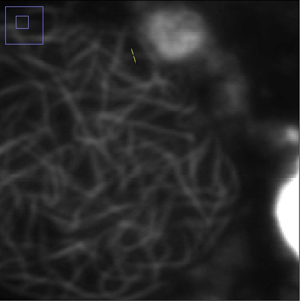

```{r setup, include=FALSE}
knitr::opts_chunk$set(echo = TRUE)
```

## Used Data
This document aims at approximating the resolution of an microscopic image by measureing the intensity profile of a structure. The data used are images of a EGFP-RAD51-overexpressing U2OS cell after induction of a DNA damage by bleomycin. RAD51 is the recombinase, which is involved in strand probing and exchange in the process of homologous recombination during the S phase of the cell cycle.

Theoretically, the resolution according to the Rayleigh criterion $$d = \frac{0.61 \lambda}{NA}$$ would be ~ **330** nm using a 0.95 NA water immersion objective and an EGFP emission of **514 nm**.



The data used is the plotted intensity profile perpendicular one RAD51 nucleoprotein filament.

```{r}
dat = read.csv("Values.csv")
print(dat)
plot(dat, xlab = "location [??m]", ylab = "Absolute Intensity")
```

One can get an idea about the resolution of the microscope by using the Gauss normal distribution with its equation

$$f(x) = k e ^ \left( \frac{(-x - \mu_0)^2}{(2 \sigma)^2} \right) $$

with 

$$ k = \frac{1}{\sqrt{2 \pi \sigma}} $$

We will now fit the intensity profile to the provided data and determine the resolution approximation by calculating the Full Width at Half Maximum value (FWHM). This is the distance between the two points of the x-axis, where the function value of f is at its half maximum. By doing some algebra with the Gauss normal distribution, we can find out that this is the case at $$2 \sqrt{2 x ln(2)} \sigma \approx 2.355 \sigma$$

See this example
```{r}

curve(1/(sqrt(2*pi*0.5^2))*exp(-(x)^2/(2*0.5^2)), from = -1.5, to = 1.5, xlab = "Location [microns]", ylab = "Intensity")

abline(v = 0.58875, lty = 2, lwd = 2)
abline(v = -0.58875, lty = 2, lwd = 2)
abline(h = 0.3989, lty = 3, lwd = 2)
text(0, 0.1, " = 0.5")

```

In this case sigma was set to 0.5. The FWHM value is 1.1775 accordingly.

## Determining the Resolution

We use the data, that have been imported previously to the dataframe *dat*. First, we define the Gauss normal distribution as a function in R. *(Note: We use k instead of the actual term in order to avoid the denominator to become 0)*
It is also beneficial to normalise the intensity values, because we want our fitted function to actually cross the y-axis at the lowest intensity values. A general approach to normalise data from 0 to 1 is
$$ X_n = \frac{(x_i - X_\min)}{(X_\max - X_\min)}$$.

```{r}
gauss = function(x, x0, k, sigma){
  k * 1/sqrt(2 * pi * sigma) * exp(-(x - x0)^2 / (2 * sigma)^2)
}

curve(gauss(x, 0, 1, 1), from = -4, to = 4)

i = 1
while(i <= length(dat$Y)){
  dat$y.norm[i] = (dat$Y[i] - min(dat$Y))/(max(dat$Y) - min(dat$Y))
  i = i + 1
}

```

The loaded data is now fitted to the gauss()-function using the non-linear least square (nls) method, which is in the standard implementation of R. Non-linear fitting can easily go in the wrong direction and the process can get stuck at a local minimum of the error function. Therefore, we define some guesses for starting parameters by just looking at the plot of our data points. The parameter x0 for example has to be a value of around 0.4. We can also get a guess of the sigma and k value from the definition of the Rayleigh criteron and the gaussian distribution. (*Be aware that you have to convert nanometers to microns!*)

```{r}
fit = nls(dat$y.norm ~ gauss(dat$X, x0, k, sigma),data = dat, start = list(x0 = 0.4, k = 1, sigma = 0.1), algorithm = "port")

summary(fit)
plot(dat$X, predict(fit), type = "l")
points(dat$X, dat$y.norm, pty = 2)

FWHM = summary(fit)[[10]][3] * 2 * sqrt(2 * log(2))

abline(v = (summary(fit)[[10]][1] + FWHM/2))
abline(v = (summary(fit)[[10]][1] - FWHM/2))
abline(h = 0.5)
```


**NOTE: Find the error! This can't be right!**

