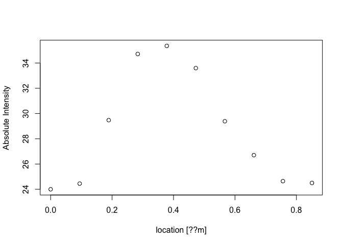
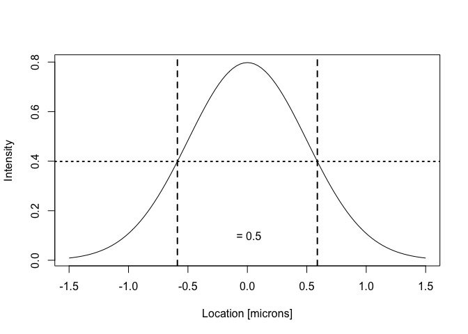

Approximating Microscopic Resolution
================

Used Data
---------

This document aims at approximating the resolution of an microscopic image by measureing the intensity profile of a structure. The data used are images of a EGFP-RAD51-overexpressing U2OS cell after induction of a DNA damage by bleomycin. RAD51 is the recombinase, which is involved in strand probing and exchange in the process of homologous recombination during the S phase of the cell cycle.

Theoretically, the resolution according to the Rayleigh criterion (d = 0.61 x lamda / NA) would be ~ **330** nm using a 0.95 NA water immersion objective and an EGFP emission of 514 nm.


The data used is the plotted intensity profile perpendicular one RAD51 nucleoprotein filament.

``` r
dat = read.csv("Values.csv")
print(dat)
```

    ##           X       Y
    ## 1  0.000000 24.0000
    ## 2  0.094512 24.4492
    ## 3  0.189024 29.4746
    ## 4  0.283536 34.7160
    ## 5  0.378048 35.3546
    ## 6  0.472560 33.5960
    ## 7  0.567071 29.3889
    ## 8  0.661583 26.7037
    ## 9  0.756095 24.6468
    ## 10 0.850607 24.5000

``` r
plot(dat, xlab = "location [??m]", ylab = "Absolute Intensity")
```



One can get an idea about the resolution of the microscope by using the Gauss normal distribution with its equation

$$f(x) = ke^\\left( \\frac{(-x - \\mu\_0)^2}{(2 \\sigma)^2} \\right) $$

with

$$ k = \\frac{1}{\\sqrt{2 \\pi \\sigma}} $$

We will now fit the intensity profile to the provided data and determine the resolution approximation by calculating the Full Width at Half Maximum value (FWHM). This is the distance between the two points of the x-axis, where the function value of f is at its half maximum. By doing some algebra with the Gauss normal distribution, we can find out that this is the case at 2 x sqrt(2 x ln(2)) x sigma. expression(sigma)

See this example

``` r
curve(1/(sqrt(2*pi*0.5^2))*exp(-(x)^2/(2*0.5^2)), from = -1.5, to = 1.5, xlab = "Location [microns]", ylab = "Intensity")

abline(v = 0.58875, lty = 2, lwd = 2)
abline(v = -0.58875, lty = 2, lwd = 2)
abline(h = 0.3989, lty = 3, lwd = 2)
text(0, 0.1, " = 0.5")
```



In this case sigma was set to 0.5. The FWHM value is 1.1775 accordingly.

Determining the Resolution
--------------------------
